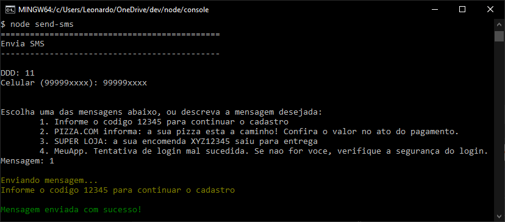
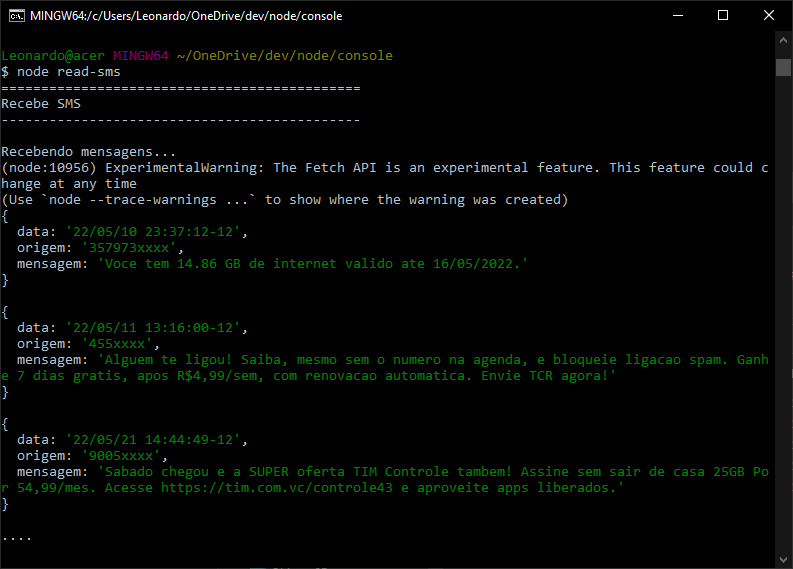

# amplimax

Envio e recebimento de mensagens SMS com NodeJS, utilizando um roteador 4g Elsys da Amplimax.

Hoje, o próprio roteador disponibiliza uma funcionalidade de envio e recebimento de SMS, porém consiste num processo manual, podendo ser automatizado para a sua necessidade. Como a interface administrativa do roteador é via browser, é possível realizar requisições restfull diretamente na API de envio e recebimento de SMS.

Você poderá utilizar o algoritmo para ser utilizado para a confirmação do cadastro do usuário, em cenários que precisam de uma validação do número de telefone celular, ou até mesmo:

> "informe o codigo 2345 para continuar o cadastro"

> "PIZZA JA: seu pedido ABC12345 saiu para entrega"

> "faça a recarga para continuar com os beneficios"

entre outros...

## Instalação (dependências)
```
npm install
```

## Variáveis

|variável|descrição|
|------------- | ------------- |
| USER|usuário de acesso ao roteador (padrão admin)|
| PASSWORD|senha do usuário de acesso ao roteador (padrão admin)|
|ADDRESS|IP do roteador (padrão 192.168.10.254)|

## Enviando SMS
```
node send-sms
```

## Recebendo SMS
```
node read-sms
```

## Notas
- O envio e recebimento de SMS possui dependências que se encontram em modelo experimental, o que faz surgir warnings no console.
- O módulo fetch apresenta incompatibilidade com o protocolo HTTP/1. Isso significa que a resposta das requisições não são tratadas dentro do then(), mas sim no catch().
- Utilize o algoritmo com moderação. Após o uso frequente, a operadora poderá bloquear o envio de SMS.
- Não utilize o algoritmo para a realização de SPAM.

## Para comprar o roteador
https://www.elsys.com.br/modem-4g-para-internet/p



